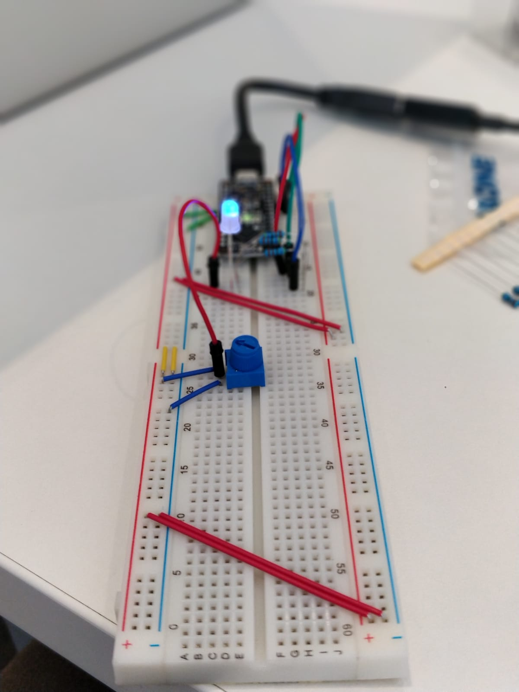
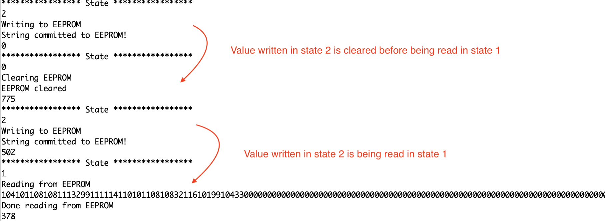
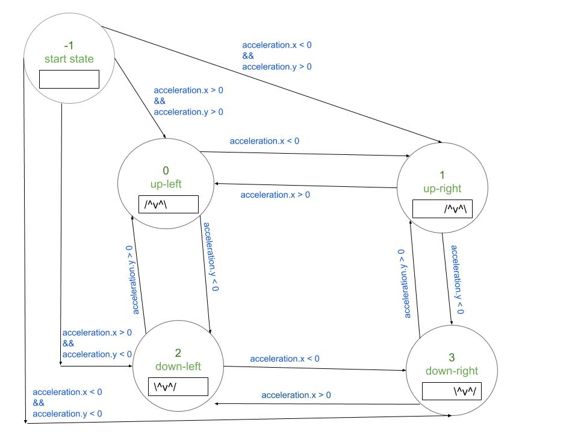

# Data Logger (and using cool sensors!)

*A lab report by Ananya Paul.*

## In The Report

Include your responses to the bold questions on your own fork of [this lab report template](https://github.com/FAR-Lab/IDD-Fa18-Lab2). Include snippets of code that explain what you did. Deliverables are due next Tuesday. Post your lab reports as README.md pages on your GitHub, and post a link to that on your main class hub page.

For this lab, we will be experimenting with a variety of sensors, sending the data to the Arduino serial monitor, writing data to the EEPROM of the Arduino, and then playing the data back.

## Part A.  Writing to the Serial Monitor
 
**a. Based on the readings from the serial monitor, what is the range of the analog values being read?**

0 to 1023
 
**b. How many bits of resolution does the analog to digital converter (ADC) on the Arduino have?**

10 bits, 2^10

## Part B. RGB LED

**How might you use this with only the parts in your kit? Show us your solution.**


I used the Ohm resistors in the kit.

## Part C. Voltage Varying Sensors 
 
### 1. FSR, Flex Sensor, Photo cell, Softpot

**a. What voltage values do you see from your force sensor?**
From 0 to 1023

**b. What kind of relationship does the voltage have as a function of the force applied? (e.g., linear?)**

FSR and Softpot are Logorithmic.
Flex Sensor and PhotoCell are linear.

**c. Can you change the LED fading code values so that you get the full range of output voltages from the LED when using your FSR?**

Connected the common node of the anode to A0, where the voltage is controlled by the pressure resistor. 

**d. What resistance do you need to have in series to get a reasonable range of voltages from each sensor?**


**e. What kind of relationship does the resistance have as a function of stimulus? (e.g., linear?)**
FSR and Flex Sensor are Logorithmic.
Photo Cell and Softspot are Linear.

### 2. Accelerometer
 
**a. Include your accelerometer read-out code in your write-up.**


```
// Basic demo for accelerometer readings from Adafruit LIS3DH

#include <Wire.h>
#include <SPI.h>
#include <Adafruit_LIS3DH.h>
#include <Adafruit_Sensor.h>

// Used for software SPI
#define LIS3DH_CLK 13
#define LIS3DH_MISO 12
#define LIS3DH_MOSI 11
// Used for hardware & software SPI
#define LIS3DH_CS 10

// software SPI
//Adafruit_LIS3DH lis = Adafruit_LIS3DH(LIS3DH_CS, LIS3DH_MOSI, LIS3DH_MISO, LIS3DH_CLK);
// hardware SPI
//Adafruit_LIS3DH lis = Adafruit_LIS3DH(LIS3DH_CS);
// I2C
Adafruit_LIS3DH lis = Adafruit_LIS3DH();

void setup(void) {

#ifndef ESP8266
  while (!Serial);     // will pause Zero, Leonardo, etc until serial console opens
#endif

  Serial.begin(9600);
  Serial.println("LIS3DH test!");
  
  if (! lis.begin(0x18)) {   // change this to 0x19 for alternative i2c address
    Serial.println("Couldnt start");
    while (1);
  }
  Serial.println("LIS3DH found!");
  
  lis.setRange(LIS3DH_RANGE_4_G);   // 2, 4, 8 or 16 G!
  
  Serial.print("Range = "); Serial.print(2 << lis.getRange());  
  Serial.println("G");


}

void loop() {
  lis.read();      // get X Y and Z data at once
  
  // Then print out the raw data
  Serial.print("X:  "); Serial.print(lis.x); 
  Serial.print("  \tY:  "); Serial.print(lis.y); 
  Serial.print("  \tZ:  "); Serial.print(lis.z); 

  /* Or....get a new sensor event, normalized */ 
  sensors_event_t event; 
  lis.getEvent(&event);
  
  /* Display the results (acceleration is measured in m/s^2) */
  Serial.print("\t\tX: "); Serial.print(event.acceleration.x);
  Serial.print(" \tY: "); Serial.print(event.acceleration.y); 
  Serial.print(" \tZ: "); Serial.print(event.acceleration.z); 
  int redLED = 1;      
  int blueLED = 2;  
  int greenLED = 3; 
  analogWrite(redLED, event.acceleration.x);
  analogWrite(greenLED, event.acceleration.y);
  analogWrite(blueLED, event.acceleration.z);

  Serial.println(" m/s^2 ");

  Serial.println();
 
  delay(200); 
}
```


## Optional. Graphic Display

**Take a picture of your screen working insert it here!**

## Part D. Logging values to the EEPROM and reading them back
 
### 1. Reading and writing values to the Arduino EEPROM

**a. Does it matter what actions are assigned to which state? Why?**
Yes. 

A Read action should come right after the Write action to read values from the EEPROM. 

**b. Why is the code here all in the setup() functions and not in the loop() functions?**
To setup states everytime there is a switching of state. The setup is different for different states. We also want to take actions only when the state is changed and not on a loop constantly. 

**c. How many byte-sized data samples can you store on the Atmega328?**

1024 byte-sized data samples

**d. How would you get analog data from the Arduino analog pins to be byte-sized? How about analog data from the I2C devices?**
With int to byte char in Wire Library
```byte hiByte = highByte(wordVal);
byte loByte = lowByte(wordVal);
Serial.println(hiByte, HEX);
Serial.println(loByte,HEX);
```
[Source](https://forum.arduino.cc/index.php?topic=72993.0)

**e. Alternately, how would we store the data if it were bigger than a byte? (hint: take a look at the [EEPROMPut](https://www.arduino.cc/en/Reference/EEPROMPut) example)**

The method EEPROM.put() can write values larger than 255 (data types greater than 1 byte). We can use EEPROM.get() to read the data.

[Source](https://forum.arduino.cc/index.php?topic=328933.15)

**Upload your modified code that takes in analog values from your sensors and prints them back out to the Arduino Serial Monitor.**
```/*
  basic state machine 2
 
  Modified to switch between states to write, read and clear EEPROM
 
 Demonstrates how to use a case statement to create a simple state machine.
 This code uses a potentiometer knob to select between 3 states.
 
 The circuit:
 * pot from analog in 0 to +5V
 * 10K resistor from analog in 0 to ground
 
 created 13 Apr 2010
 by Wendy Ju 
 modified from switchCase by Tom Igoe
 
 12 Sep 2018
 Modified to switch between states to write, read and clear EEPROM
 */

#include <EEPROM.h>

const int numStates = 3;
const int sensorMin =0;
const int sensorMax = 1024;
const int EEPROMSIZE=1024;

int sensorPin = A2;    // select the input pin for the potentiometer
int ledPin = LED_BUILTIN;    
int state,lastState = -1;

void setup() {
  // initialize serial communication:
  Serial.begin(9600);  
  pinMode(ledPin, OUTPUT);  
}

void loop() {
 
  // map the pot range to number of states :
  Serial.println(analogRead(sensorPin));
  delay(100);
  state = map(analogRead(sensorPin), sensorMin, sensorMax, 0, numStates);
  Serial.println("***************** State *****************");
  Serial.println(state);
  // do something different depending on the 
  // range value:
  switch (state) {
  case 0:    
    doState0();
    break;
  case 1:    
    doState1();
    break;
  case 2:    
    doState2();
    break;
  } 
  lastState = state;
}
```
### 2. Design your logger

I built a toy to translate bird motion to the Serial Monitor. 
When the bird flies up the feather opens. /^v^\
When the bird flies down the feather closes. \^v^/
The bird moves left and right on the screen based on the movement of the accelerometer. 

I am writing the state based on the movement of the accelerometer to the EEPROM. 
I am displaying the movement of the bird on the serial monitor based on the last state being read from the EEPROM. 
 
**a. Insert here a copy of your final state diagram.**


### 3. Create your data logger!
 
**a. Record and upload a short demo video of your logger in action.**

